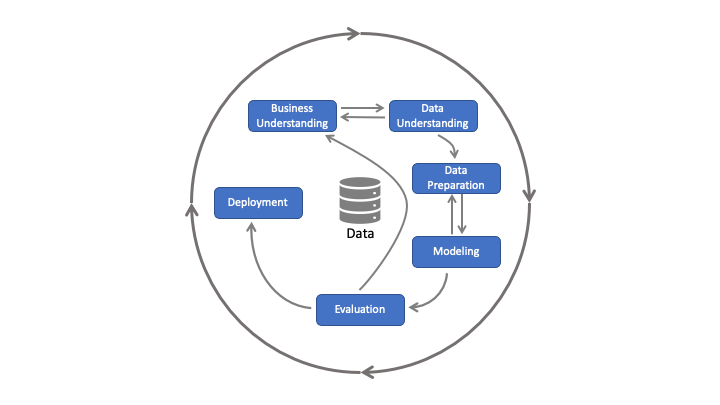
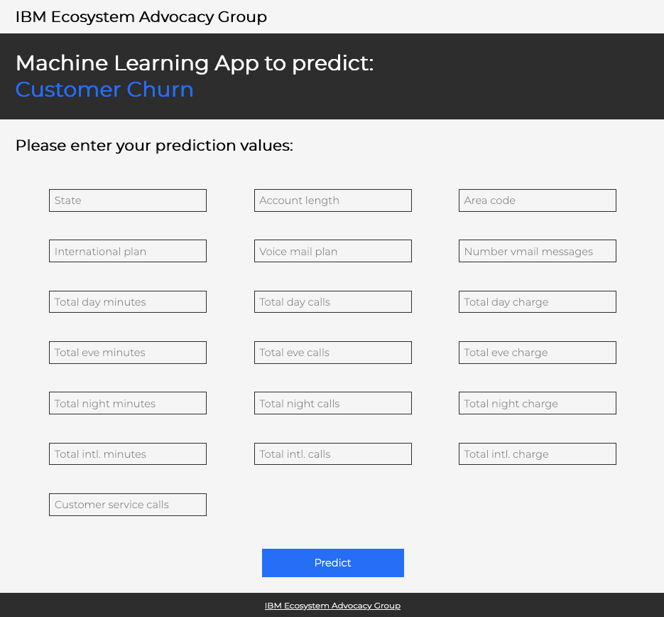

<h1 align="center" style="border-bottom: none;">:bar_chart: IBM Cloud Pak for Data Tutorial: Part V</h1>
<h3 align="center">In this hands-on tutorial you will deploy a local Python app to test your model.</h3>

## Prerequisites

1. Sign up for an [IBM Cloud account](https://cloud.ibm.com/registration).
2. Fill in the required information and press the „Create Account“ button.
3. After you submit your registration, you will receive an e-mail from the IBM Cloud team with details about your account. In this e-mail, you will need to click the link provided to confirm your registration.
4. Now you should be able to login to your new IBM Cloud account ;-)
5. Make sure to [download Python](https://www.python.org/downloads/)

## IBM Cloud Pak for Data Tutorials Part I to VI

This tutorial consists of 6 parts, you can start with part I or any other part, however, the necessary environment is set up in part I. 
[Part I - data visualization, preparation, and transformation](https://github.com/FelixAugenstein/cloud-pak-for-data-tutorial) 
[Part II - build and evaluate machine learning models by using AutoAI](https://github.com/FelixAugenstein/cloud-pak-for-data-tutorial-part-ii) 
[Part III - graphically build and evaluate machine learning models by using SPSS Modeler flow](https://github.com/FelixAugenstein/cloud-pak-for-data-tutorial-part-iii) 
[Part IV - set up and run Jupyter Notebooks to develop a machine learning model](https://github.com/FelixAugenstein/cloud-pak-for-data-tutorial-part-iv) 
[Part V - deploy a local Python app to test your model](https://github.com/FelixAugenstein/cloud-pak-for-data-tutorial-part-v) 
[Part VI - monitor your model with OpenScale](https://github.com/FelixAugenstein/cloud-pak-for-data-tutorial-part-vi)

The first 4 parts of this tutorial are based on the [Learning path: Getting started with Watson Studio](https://developer.ibm.com/series/learning-path-watson-studio/).

<h4>1) CRISP-DM</h4>
The <b>CR</b>oss <b>I</b>ndustry <b>S</b>tandard <b>P</b>rocess for <b>D</b>ata <b>M</b>ining is a model to display the cycle of a data science project. It consists of six phases: 
1. Business Understanding - What does the business need? 
2. Data Understanding - What data do we have and how is it made up of? 
3. Data Preparation - How can we structure the data for the modeling? 
4. Modeling - Which modeling techniques could apply? 
5. Evaluation - Which model is the most accurate? 
6. Deployment - How to implement the model? 

In this case we only focus on the deployment of the model. 

## Start the app

- Download the repository to start the app on your local machine
- Open `.env.example`, rename it to `.env` and enter your API-Key, URL, Space-ID and Deployment-ID, then save the file
  * If you don't have one already create a new API-Key [here](https://cloud.ibm.com/iam/apikeys) or check out the previous Tutorial.
  * The default url for wml services in the US is `https://us-south.ml.cloud.ibm.com`
  * Find your Space-ID in your IBM Cloud Pak for Data --> Deployment Spaces --> Your Deployment Space --> Manage --> Space GUID or in the URL
  * Find your Deployment-ID in your IBM Cloud Pak for Data --> Deployment Spaces --> Your Deployment Space --> Deployments --> Your Deployment --> Info Panel on the right hand side

- Start a terminal at the folder that contains the file `app.py`, in this case the folder is cloud-pak-for-data-tutorial-part-v-master
- You might have to install IBM Watson ML with the following commands: `pip install ibm_watson-machine-learning`
- You might also have to install flask, python-dotenv and python-decouple with the following commands: `pip install flask` or `pip install -U Flask` , `pip install python-dotenv` and `pip install python-decouple`
- Then start the app by typing: `python app.py` or if you are using python3 `python3 app.py`
- Insert some values and hit the predict button

## If you have any questions just contact me
Felix Augenstein 
Digital Tech Ecosystem & Developer Representative @IBM 
Twitter: [@F_Augenstein](https://twitter.com/F_Augenstein) 
LinkedIn: [linkedin.com/in/felixaugenstein](https://www.linkedin.com/in/felixaugenstein/)
